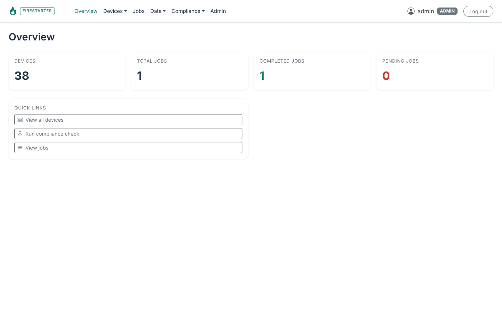
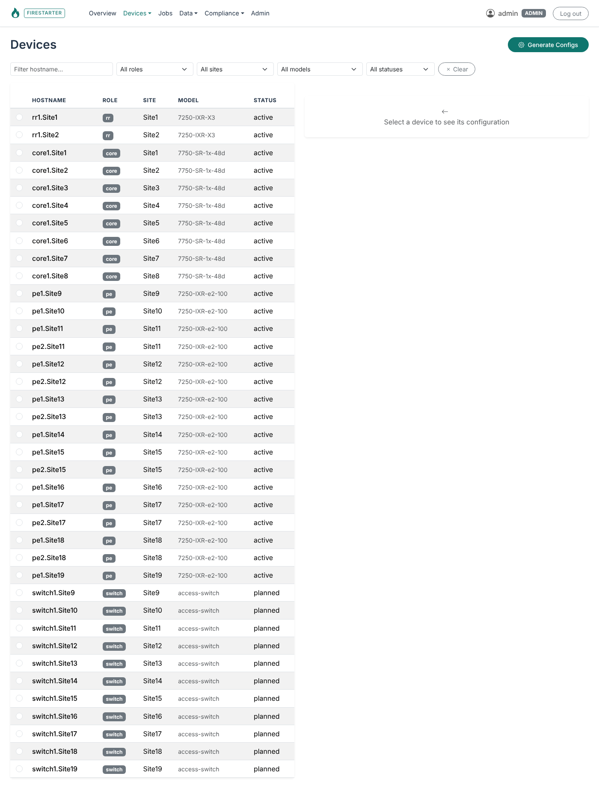
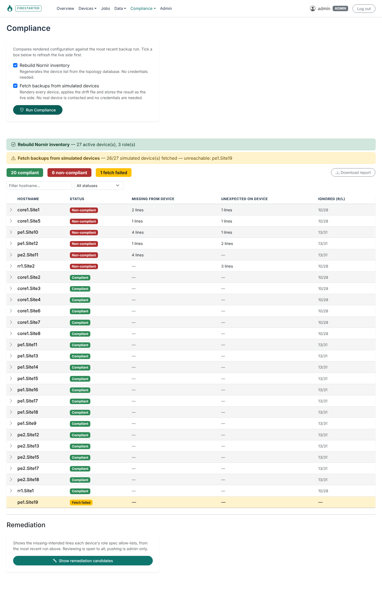
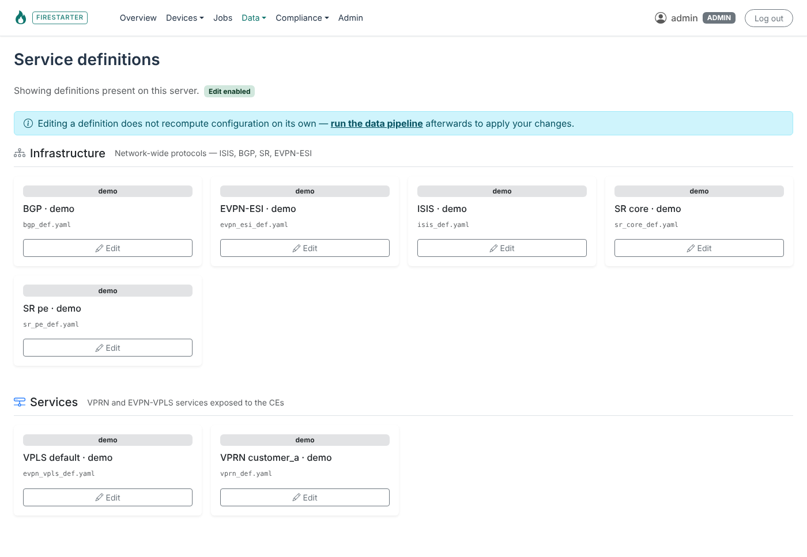

# Network Configuration Builder

This project started in November 2025, driven by concrete customer requirements: generate complete, deterministic network device configurations (including underlay and overlay services) from a persisted topology.

Nothing less. Nothing more.

The goal is not orchestration but compilation: transforming validated topology and service intent into vendor-specific device configurations in a reproducible and explainable way.

This project is also a personal exploration of modern design patterns and architectural principles, applied pragmatically through “learning by doing”.

Hans Verkerk  
April 2026

## Demo

This repository is the **demo version** of a tool that runs in production. The code is
the real thing; the data is not. In place of the production network it ships with a small
synthetic topology:

- 2 route reflectors (role `rr`) and 8 core routers (role `core`)
- 11 PE sites (role `pe`) hung off the core in half-open rings that terminate on
  the `core1` routers of the two termination sites
- one access switch (a CE, role `switch`) per PE site
- a VPRN (L3 VPN) on VLAN 20 and a VPLS (L2 VPN) on VLAN 30 across the PE sites;
  the VPRN doubles as the CE-management VPRN in which every switch gets a sticky
  management address

The demo data lives under `data/` and is tracked in git: the topology workbook
(`topology.xlsx`), the service and addressing YAML, the compliance reference inputs and
the simulated-device drift file. Everything else under `data/` (database, rendered
configs, backups, inventory, snapshots) is generated by the bootstrap script.

No real devices are involved. The Nornir/Netmiko automation code (device backup, config
push, compliance fetch) is kept for reference, but every action that would contact a
device is disabled in this version.

### Quick start

```bash
python3 -m venv .venv
.venv/bin/pip install -e ".[dev]"
FIRESTARTER_DEMO=1 .venv/bin/python scripts/bootstrap_demo.py   # schema, pipeline, render, simulated backups, compliance, inventory
FIRESTARTER_DEMO=1 .venv/bin/python run.py                      # dashboard on http://127.0.0.1:5000
```

Log in as `admin` / `changeme`. `FIRESTARTER_ADMIN_PASSWORD` sets a different bootstrap
password; `FIRESTARTER_DEMO=1` keeps that password usable instead of forcing a change on
first login — leave it unset on anything that is not a throw-away demo. The bootstrap
script is idempotent and expects the demo data root (`data/`) to be in place; see
[Onboarding](docs/ONBOARDING.md) for the general clone → running story.

The devices are **simulated**: a "backup" is the device's own rendered configuration,
reshaped into an SR OS flat dump, with the deviations listed in
`data/simulation/drift.yaml` applied — so the Compliance and Remediation pages have
real-looking drift to show without a single router being contacted.


### Screenshots

| Overview | Devices |
|---|---|
|  |  |

| Compliance run against the simulated devices | Service definitions |
|---|---|
|  |  |

The dashboard loads Bootstrap from a CDN, so the browser needs internet access for
styling (the application itself makes no outbound connections).

## What it does

- Persists network topology (devices, interfaces, links) sourced from an Excel document. In `tests/` an example file is included.
- Accepts service, protocol and addressing intent defined in YAML
- Computes complete, vendor-agnostic configuration intent
- Renders vendor-specific device configurations using Jinja2 templates

## What it does *not* do

- No configuration deployment or execution
- No attempt to be a full CMDB or inventory system

This tool assumes that topology and intent are the source of truth
and treats configuration generation as a compile-time operation.

## Typical Workflow

1. Create or update persisted network topology by modifying the Excel document
2. Insert resource pools. These are defined in the Excel document and added to the DB.
2. Define services and addressing policies using YAML specifications. 
3. Compile topology and intent into device-scoped configuration data
4. Render complete device configurations using vendor templates

## Design principles

- Topology-first: all computation derives from persisted topology
- Deterministic execution: identical inputs produce identical outputs
- Idempotency: recomputation is always safe
- Clear separation of concerns:
  - topology storage
  - intent computation
  - rendering
- Vendor-agnostic computation with vendor-specific rendering

## Intended use

The Network Configuration Builder is designed for:

- Greenfield environments without an established CMDB
- Engineers who need reproducible, explainable configurations
- Incremental adoption without requiring a large operational platform

It is deliberately lightweight and focused.

## Documentation

- **[Installing and running on a VM](docs/INSTALL_VM.md)** — step by step, including a systemd service.
- **[Onboarding — from clone to running](docs/ONBOARDING.md)** — start here. A fresh clone
  has no data: the test suite passes, but the pipeline and dashboard need a data root first.
- [Architecture Overview](docs/ARCHITECTURE.md) — what the system is
- [Architecture Decision Records](docs/adr/README.md) — why it is that way
- [Adding a new service](docs/ADDING_A_NEW_SERVICE.md)