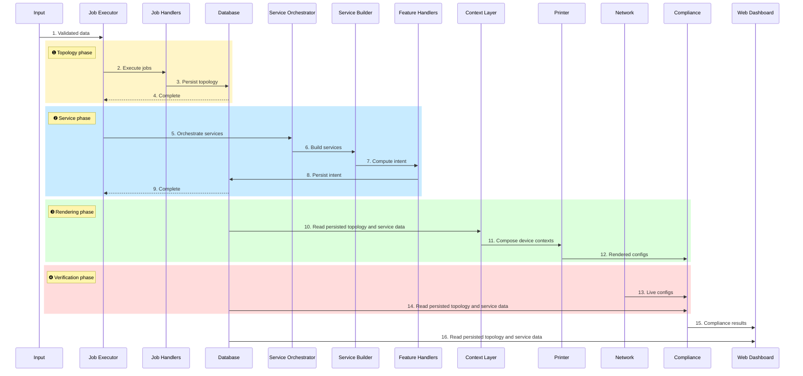
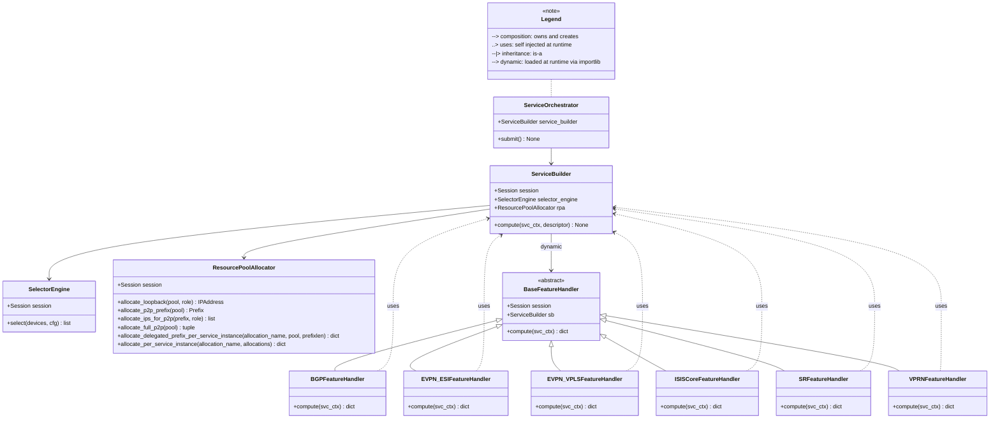
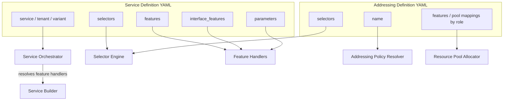
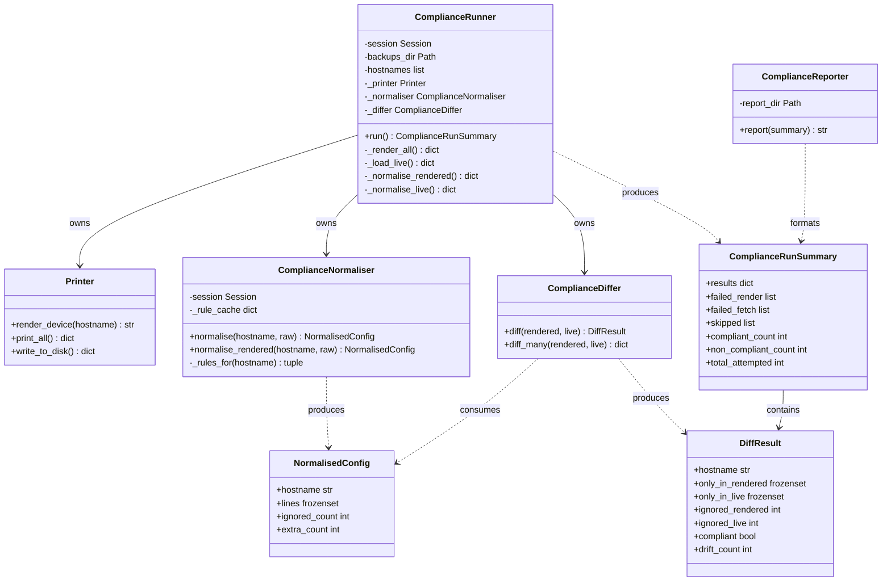
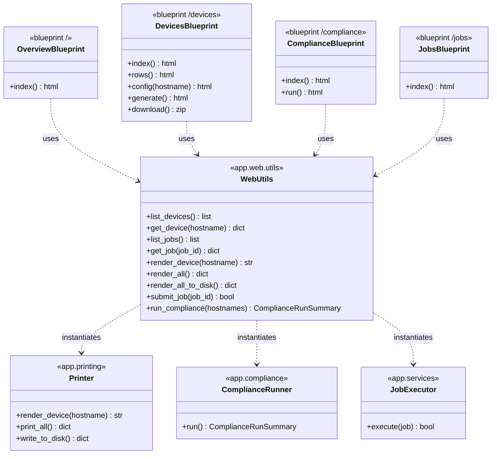

# Architecture Overview

This document describes the internal architecture of the `Firestarter` Network Configuration Builder.

The system is designed to compute complete, deterministic device configurations from a persisted topology, validate them against live devices, and verify the operational state of the network.

---

## System Pillars

The system is organised around three functional pillars:

1. **Configuration Building** — compute and render vendor-specific device configurations from a persisted topology.
2. **Compliance Reporting** — diff rendered configurations against configurations fetched from live devices and report deviations.
3. **Web Dashboard** — a browser-based interface for operating both pillars without touching the CLI.

Each pillar is independently callable through the [Web layer](#web-dashboard).

---

## Core Principles

- Topology-first  
  All computation derives from a persisted topology model (devices, interfaces, links, roles).

- Deterministic computation  
  Given the same topology and service definitions, the output is always identical.

- Loose coupling  
  Topology, intent, computation, and rendering are clearly separated.

- Idempotency  
  Re-running the same inputs produces the same outputs.

---

## Data root and file locations

Module: `app.domain.file_locations`
[View source](../app/domain/file_locations.py)

Every per-environment **data** file (the database, `topology.xlsx`, the service /
addressing definitions, the compliance `ignore` / `extra` / `remediation`
inputs) and every **writable output** directory (rendered `artifacts`, device
`backups`, compliance `reports`) lives under a single `DATA_ROOT`,
in a **flat layout that contains no code**:

```
<DATA_ROOT>/
  app.db  topology.xlsx
  services/{definitions,addressing}/
  compliance/{ignore,extra,remediation,reports}/
  backups/   artifacts/
  automation/generated/   logs/
```

Each path is declared once in the registry as a `FileLocations`; its `.path`
property resolves against the live data root, so no module computes data paths
from its own `__file__` or the process CWD.

`DATA_ROOT` is read live from the `FIRESTARTER_DATA` environment variable and
falls back to `<repo>/data` — a single gitignored directory holding no code, so a
plain checkout and its worktrees work with zero configuration. Setting
`FIRESTARTER_DATA` repoints **all** data and output at once to an external,
project-namespaced root: `<data-root>` on a deployed instance, or
`/data` (a mounted volume) in a container, keeping the repository / image pure
code. Code and Jinja2 templates are never declared here: they travel in git / the
image and resolve relative to their own module.

This is the runtime counterpart to the download-bundle taxonomy in
`app.data_bundle.spec` (which derives from this same registry for the seed/bundle
path); see [ADR 0001](adr/0001-code-vs-environment-data.md). An existing install on the
old nested layout is moved onto this one with `python -m app.data_bundle.migrate_layout`
(one-time), which copies the old `app/...` data into the data root.

---

## Database model

Module: `app.models`
[View source](../app/models)

The models are used to persist topology and service data.
SQLite was chosen for its lightweight and simple deployment model, while SQLAlchemy provides strong integration with Python and robust type checking support via Pylance.

This combination offers a high degree of control over model design, allowing the data structures to closely reflect the underlying domain and business logic.

---

## Excel data entry

Module: `app.excel_data_handing`
[View source](../app/excel_data_handling)

Responsibilities:
- Load topology: devices, links (optional, can be auto derived), interfaces, roles
- Performs strict input data validation
- Define prefix and resource pools and load them into DB incrementally
- Create DB and Excel snapshots after a topology/service run.

Input sheets of the workbook:

| Sheet | Content |
|---|---|
| `Devices` | Core and route-reflector routers (`DeviceName`, `DeviceRole`, `Site`, `Model`, `Tenant`); roles `core` and `rr` |
| `DistDevices` | PE routers (role `pe`). A cell `pe1.<site>,pe2.<site>` declares an A/A PE pair |
| `HalfOpenRings` | One row per ring: `Termination_site_a`, the PE cells in ring order, `Termination_site_b`. The ring ends are derived as `core1.<site>` (or `core1`/`core2` of one site) — see `app/domain/half_open_ring.py` |
| `Cables` | Explicit links (`Device_a`, `Iface_a`, `Device_b`, `Iface_b`); port cells may be empty for auto assignment |
| `CEs` | Access switches behind a PE (`CEname`, `SiteName`, `ModelName`, `CERole`, `ConnectedPE`) |
| `Role`, `Site` | Reference data; `Site` is keyed by `SiteName`, the postal columns are optional |
| `PrefixPoolTypes`, `PrefixPools`, `ResourcePools` | IP and integer pools the addressing policy and services allocate from |

The pipeline writes three report tabs back into the workbook: `report_devices`,
`report_links` and `report_ce_mgmt` (the sticky management address of every CE
inside the CE-management VPRN's subnet).

---

## Job Executor and Job handlers

Module: `app.services.job_handling`
[View source](../app/services/job_handling/)

The Job Executor coordinates all work in the system.

Responsibilities:
- The Jobs are implicit defined in the Excel input
- The JobExecutor module provides and injects the database session into dependent components, adhering to the dependency injection (DI) pattern.
- The JobExecutor module also executes the jobs after loading IP addressing policies.
- Specialized Job Handlers maintain idempotency and invoke topology builders
- Apply topology changes incrementally.
- Triggers a full service orchestration run after all jobs have been executed.

---

## Topology Builders

Module: `app.services.service_handling.topology_building`
[View source](../app/services/topology_building/)

Responsible for constructing and modifying the persisted topology model:

- Devices (including roles and metadata such as labels)
- Interfaces and LAGs (parent/member relationships)
- Physical connectivity
- IP address allocation
- Resource allocation (IDs, labels, protocol parameters)

Topology is persisted and serves as the system's single source of truth.

---

## IP and Resource Allocation

YAML Definitions: environment data under the data root at `services/addressing/`
(resolved via `app.domain.file_locations`), not in the repository.

Addressing Policy Resolver:
[View source](../app/services/service_handling/addressing_policy_resolver.py)

Resource Pool Allocator:
[View source](../app/services/service_handling/resource_pool_allocator.py)

IP addressing and other allocatable resources are handled explicitly and deterministically:
- Interfaces eligible for IP assignment are selected automatically based on topology attributes (e.g. interface role, LAG parent, loopback).
- Address assignment is driven by allocation policies, defined in YAML templates
- Different pools and policies can be applied, for example:
  - by device role (pe, core, rr, ...)

---

## Service Orchestrator

Module: `app.services.service_handling.service_orchestrator`  
[View source](../app/services/service_handling/service_orchestrator.py)

The Service Orchestrator controls execution order:

1. Underlay and Overlay services
2. Basic validation of YAML service definitions
3. Invocation of the Service Builder

---

## Service Builder

Module: `app.services.service_handling.service_builder`  
[View source](../app/services/service_handling/service_builder.py)

The Service Builder is responsible for computing intent-derived data.

Responsibilities:
- Executes the relevant Feature Handlers for a service
- Aggregates their output
- Persists computed results per ServiceInstance in the DB

---

## Feature Handlers

Feature handlers:
[View source](../app/services/service_handling/feature_handlers/)

YAML definitions: environment data under the data root at `services/definitions/`
(resolved via `app.domain.file_locations`), not in the repository.

Feature Handlers compute protocol- or service-specific intent from topology and YAML defined service definitions.

Characteristics:
- Protocol-aware (deep domain knowledge lives here)
- Deterministic
- Stateless aside from persisted topology and allocations
- Easy to extend or replace

Examples:
- Underlay protocols (IS-IS, BGP, SR)
- Overlay services (EVPN, L2VPN, L3VPN)
- Ring- or role-based reachability
- Service-specific resource allocation

Feature Handlers produce vendor-agnostic, device-scoped intent.

---

## Context Layer

Context layer:
[View source](../app/services/context/)

The Context Layer composes render-ready device contexts by:

- Projecting topology into device/interface render units
- Merging protocol intent into those render units
- Normalizing data for deterministic rendering

---

## Configuration Rendering

Templates:
[View source](../app/services/templates/sros/)

Computed contexts are rendered using Jinja2 templates.

Characteristics:
- Vendor-specific
- Stateless
- No topology or protocol logic

This allows multiple vendors to be supported without changing computation logic.

Templates get a few custom Jinja filters, registered on the environment in
`Printer._get_env`:

| Filter | Purpose |
|---|---|
| `peer_ip_on_p2p` | The other address of a /30 or /31 |
| `breakout_name` | A connector-breakout name as the device knows it — `c1-400g-9266.250` → `c1-400g`, and the named `c1-400g-horseshoe` → `c1-400g` |
| `coherent_frequency` | The DWDM channel that same name encodes, in megahertz — channel `9266.250` → `192662500`; `None` for a grey optic |

Coherent DWDM optics are modelled through the connector-breakout name alone: a
port's connector type carries a name that also names the DWDM channel it is tuned
to. The router frequency in MHz is that channel with a leading
`1` and a trailing `0` — channel `9266.250` → `192662500` MHz (192.6625 THz),
equivalently `100_000_000 + channel * 10_000`. A few "fake" connectors name a fixed
channel by an engineering label instead of a number: `c1-400g-horseshoe` is the
metro-ring optic — strings of PE routers homed onto two core routers —
pinned to channel `9310.000` (193.1 THz). The device has no such breakout type, so
the suffix is stripped from the `connector breakout` line and reappears in
`underlay.j2` as `transceiver digital-coherent-optics true` followed by
`dwdm coherent compatibility long-haul` and `dwdm frequency` — the transceiver line
first, since it is what puts the port in coherent mode. Every coherent link is
engineered long-haul; the compatibility mode does not depend on the roles the link
terminates on. All of the lines are written against the *connector* port (`1/1/c1`)
rather than the breakout port (`1/1/c1/1`) — the optic is the connector, so that is
where SR OS keeps its coherent configuration.

---

## Printer

Module: `app.printing`  
[View source](../app/printing/printer.py)

Used to output rendered device configurations.
Rendered configs are written to `app/artifacts/latest/` and previous renders are automatically archived to timestamped sibling directories.

---

## Compliance

Module: `app.compliance`  
[View source](../app/compliance/)

The Compliance module diffs rendered configurations against live device configurations fetched from the network.

Pipeline:
1. **Printer** — render all device configs in memory and write to disk.
2. **Fetcher** — load the most recent local backup run from `backups/latest/` under
   the data root (`<hostname>.cfg` for the configs, `fetch_results.json` for per-device outcomes).
   Refreshing it is a separate, shell-invoked step: `app/automation/backup.py`.
3. **Normaliser** — strip noise and apply ignore rules to both sides before diffing.
4. **Differ** — symmetric set diff per device.

Output is a `ComplianceRunSummary` containing per-device `DiffResult` objects, along with lists of devices that failed to render, failed to fetch, or were skipped. Failures are isolated per device — a problem on one device does not prevent others from being diffed.

### Remediation

Sub-package: `app.compliance.remediation` (rationale: [ADR 0004](adr/0004-compliance-remediation.md)).

Remediation projects a compliance diff into an operator-pushable plan with two halves:
it **adds** missing-intended config (`only_in_rendered` — lines the renderer produces
but a live device lacks, pushed back verbatim from the render) and **removes**
unexpected config (`only_in_live` — stale lines on the device, removed by explicit
operator commands). Both self-quiesce, so a successful push makes the next diff clean.

Rules live in a per-role `remediation/<role>.yaml` file (per-environment data,
gitignored like `ignore/*.yaml`), with two rule keys and a conditions gate:

- **`add`** — reuses the ignore-file match grammar (`startswith`/`exact`/`regex`),
  matched against `only_in_rendered`. A missing line is a candidate only if some rule
  matches it, and the matched line is what gets pushed (derived). Deny by default.
- **`delete`** — the same grammar matched against `only_in_live`. Because a `delete`
  command cannot be derived from the matched line, each rule carries **`remediation_commands`**:
  the explicit MD-CLI command(s) emitted when it matches an unexpected line. They are
  literal except for **capture-group substitution**: a `regex` rule may name groups
  (`(?P<subnet>…)`) and a command may reference them with `{name}` placeholders, filled from
  the matched line (so a per-pool subnet reaches an otherwise-fixed delete); such a command
  is emitted once per matched line, deterministically ordered. This reads the live side
  deliberately (ADR 0004 amendments), superseding the earlier additive-only stance; a BGP RR
  migration is an `add` (new peer) plus a `delete` (old peer). Additions and deletions ride
  the same commit-confirmed push.
- **`conditions`** — a required `Device.status` and any `Device.labels` key/values.

`project_remediation(results, session)` turns a run's `DiffResult` set into
`DeviceRemediation` candidates (`add`-derived `lines` plus `delete`-emitted
`remediation_commands` per device, each flagged *eligible* or *blocked-with-reason*) — a pure
read, no device contact. A device is reported when it has either half. The dashboard
renders this as a second lens (`GET /compliance/remediation`),
additions as `+` and delete commands as `~`; the admin-only push
(`POST /compliance/remediate`) re-derives the eligible lines server-side from the
hostname and hands them to the same commit-confirmed deploy engine the Service
Snippets page uses (`app.automation.deploy`).

---

## Automation

Module: `app.automation`
[View source](../app/automation/)

Device access, built on Nornir + Netmiko. Two things live here:

- **Inventory** (`inventory.py`) — generates `hosts.yaml` / `groups.yaml` from the
  topology database. Derived, never hand-maintained, and only `active` devices are
  included. It carries **no credentials**: the caller injects them at run time.
- **Backup** (`backup.py`) — fetches the flat running configuration from every
  device in that inventory and writes it to `backups/latest/` under the data root,
  which is the live side of every compliance run. The previous run is archived to a
  timestamped sibling rather than overwritten. A device that fails is recorded in
  `fetch_results.json` and deliberately gets **no** `.cfg` file, so a missing
  config can never be mistaken for a real one.

The netmiko driver for Nokia MD-CLI is a local subclass (`driver.py`) registered
as device type `nokia_sros_mdcli`. It corrects config-mode handling that stock
`NokiaSrosSSH` gets wrong for our SR OS release. Reads are unaffected either way —
only the config-write path differs — but keeping the correction in the repository
means it survives a virtualenv rebuild, which an in-place edit to `site-packages`
does not.

Fetching is a shell step, not a dashboard button: it reaches every device and
prompts for credentials.

### Device credential store

The production device admin password is recorded on the Admin page as a hash in
`device_credential` (werkzeug scrypt, hash only — never recoverable). It is a
**named** record, so more shared credentials need no schema change; nothing in this
demo pushes it to a device.

---

## Web Dashboard

Module: `app.web`  
[View source](../app/web/)

The Web Dashboard is a read-oriented browser interface built on Flask, htmx 2, and Bootstrap 5. It exposes both system pillars without requiring direct CLI or Python access. Every page is gated behind authentication.

### Application factory

`app.web.create_app(*, bootstrap=True)` constructs the Flask application and registers all blueprints. Static assets and Jinja2 templates are resolved relative to `app/web/`. When `bootstrap` is true (the default), it also runs `ensure_schema()` (idempotent `create_all` — adds the `user`/`user_role` tables to an existing DB without dropping anything) and seeds the default roles plus a bootstrap admin. Route tests pass `bootstrap=False` so importing the app never touches the real database.

### Authentication & authorization

Login is password-based. Only a salted hash is stored (`werkzeug.security`, scrypt by default) — never the plaintext. The logged-in identity (`id`, `username`, `role`, `must_change_password`) is kept in Flask's signed session cookie, so the per-request gate reads the cookie only and the database is touched solely at login, password change, and admin actions.

- **Global gate** — a `before_request` hook redirects anonymous users to `/login`; an authenticated user still carrying `must_change_password` is funnelled to `/change-password` until they comply. The `auth` blueprint and static assets are allow-listed.
- **Roles** — `UserRole` is a reference table (mirroring the device `Role` pattern, not a Python enum) seeded with `admin`, `ro`, `rw`. This sprint *stores and displays* the role and gates the admin panel on `admin`; per-action `ro`/`rw` enforcement is a later sprint.
- **Bootstrap admin** — on first run (no users), an `admin` / `changeme` account is created with `must_change_password=True`, so a fresh deployment is reachable without a permanent known credential.
- **Layering** — `app/web/accounts.py` holds session-taking domain logic (hashing, the forced-change flag, and the safety rails that stop the last admin being demoted or deleted, and an admin self-deleting); `app/web/auth.py` holds the Flask request-context helpers and the `login_required` / `admin_required` decorators; `app/repositories/user.py` holds the queries.

### Blueprints

| Blueprint | Prefix | Responsibility |
|---|---|---|
| `auth` | `/login`, `/logout`, `/change-password` | Login, logout, forced first-login password change |
| `admin` | `/admin` | User management (admin-only): create, change role, reset password, delete; record the device-admin credential |
| `overview` | `/` | Summary counts — devices, jobs, completed vs pending |
| `devices` | `/devices` | Device table, hover config preview, generate all, ZIP download |
| `compliance` | `/compliance` | Run compliance, display per-device diff results, project remediation candidates and show what a push would commit (pushing is disabled in this demo) |
| `jobs` | `/jobs` | Job list with status |
| `pipeline` | `/pipeline` | Run the full ingestion + service-computation pipeline (rw/admin); archives a snapshot |

### htmx partials

Expensive operations are triggered without full page reloads:

- **Config preview** — `mouseenter` on a device row fires `GET /devices/<hostname>/config`; the rendered config appears in a sticky side panel. The panel clears automatically a few seconds after the cursor leaves.
- **Generate configs** — `POST /devices/generate` renders all devices to disk and returns a result summary.
- **Compliance run** — `POST /compliance/run` executes the compliance pipeline and returns the results table.
- **Remediation** — `GET /compliance/remediation` returns the candidate list projected from the last run (a pure read); `POST /compliance/remediate` (admin-only) re-derives one device's eligible lines server-side and checks them against the digest the page showed. `POST /compliance/remediate-pe` (admin-only) does the same for **every eligible pe device at once**. In this demo both stop there: the result carries the lines a push would have committed and the notice "Push to device is disabled in this demo" — no device is contacted. (`app.automation.deploy` still holds the commit-confirmed push engine for reference.)
- **Pipeline run** — `POST /pipeline/run` runs the full ingestion + service-computation pipeline synchronously and returns a result partial; on failure the full traceback is shown in a modal. The pipeline itself (`app.pipeline.run_pipeline`) is the single code path shared with the `main.py` CLI, so terminal and dashboard runs are identical and both record a datetime-named `do_all_*` Job row.

### Templates

```
app/web/templates/
  base.html                   Navbar (with logged-in identity + logout), CDN assets, brand
  login.html                  Sign-in form (navbar hidden)
  change_password.html        Forced/self-service password change (navbar hidden)
  admin.html                  Admin panel: create-user form + user roster
  overview.html
  devices.html
  compliance.html
  jobs.html
  pipeline.html               Run-pipeline page: trigger button + last-run result
  partials/
    config.html               Device config panel (dark-themed pre block)
    config_error.html         Friendly error card for unmodelled devices
    generate_result.html      Generate summary with download link
    compliance_results.html   Filterable diff table with inline expand/collapse
    pipeline_result.html      Pipeline outcome (success alert / error + traceback modal)
    user_table.html           Admin user roster (htmx swap target, inline error banner)
```

The navbar is hidden on the login and forced-password-change screens (`base.html` gates it on `current_user and not current_user.must_change_password`).

### Design decisions

- **Utils-only** — routes never touch SQLAlchemy directly; every data access goes through `app.web.utils`. This module owns the session lifecycle: it opens a session, instantiates the relevant domain class (Printer, ComplianceRunner, etc.), and closes the session before returning plain Python objects. This prevents `DetachedInstanceError` and keeps SQLAlchemy out of the view layer entirely.
- **Client-side filtering** — device and compliance tables are filtered in JavaScript using `data-*` attributes on rows. No server round-trips for filtering a finite fleet.
- **Row striping** — tables use a manual `.row-stripe` class applied via `loop.index % 2` in Jinja rather than Bootstrap's `table-striped`, because Bootstrap's `nth-of-type` selector counts hidden collapse rows and breaks the alternating pattern.
- **CDN assets** — Bootstrap 5.3.8, Bootstrap Icons 1.11.3, and htmx 2.0.10 are loaded from jsDelivr. Bundling as local static files is a planned future step to support air-gapped deployments.

---

## Execution Flow

### Configuration Build

1. Topology is built or modified and persisted if needed.
2. Job Executor triggers Service Orchestration.
3. Service Builder runs Feature Handlers.
4. Computed intent is persisted per ServiceInstance.
5. Context Layer composes render-ready device contexts.
6. Device configurations are rendered.

Execution can be performed in `dry_run` mode. In this mode, any error will trigger a full rollback of all database transactions, ensuring no state is persisted.

In non-dry-run mode, errors also result in a full transaction rollback to prevent inconsistent or stale state.

### Compliance Run

1. Printer renders all configs and writes them to disk.
2. Live configs are loaded from the most recent backup run under `backups/latest/` (data root).
3. Both sides are normalised.
4. A symmetric diff is computed per device.
5. A `ComplianceRunSummary` is returned.

---

## Scope

The architecture is designed to support:

- Large-scale service provider and data center networks
- Complex topologies (rings, aggregation/distribution layers, multiple fabrics)
- Multiple concurrent services and protocol instances
- Incremental, repeatable, and auditable configuration generation

---

## Architecture Diagrams

### 1. System Execution Flow

End-to-end sequence across all four phases: topology build, service build, rendering, and verification.



---


### 2. Job & Topology Pipeline — (Class)

Same as above with the legend explicitly linked to the central class.

```mermaid
classDiagram
    class Legend {
        <<note>>
        --> composition: owns and creates
        ..> uses: self injected at runtime
        --|> inheritance: is-a
    }

    class JobExecutor {
        +Session session
        +execute(job) bool
    }

    class AddressingPolicyResolver {
        +SelectorEngine selector_engine
        +install()
        +resolve_loopback0_pool(selector_view) str
        +resolve_loopback1_pool(selector_view) str
        +resolve_p2p_pool(dev_a, dev_b) str
    }

    class DeviceBuilder {
        +Session session
        +DeviceFactory device_factory
        +ResourcePoolAllocator prefix_allocator
        +build_device(hostname, model_name, role_name, site_name, loopback0_pool, loopback1_pool, tenant, ring) Device
        +build_loopback_interface(device, loopback_index) Interface
        +assign_ip_address_to_interface(iface, ip) Interface
        +select_free_nni(device) Interface
        +select_free_uni(device) Interface
        +create_nni_lag(device) Interface
        +create_uni_lag(device) Interface
        +create_lag_with_id(device, lag_id, role) Interface
        +attach_to_lag(physical, lag) None
    }

    class TopologyBuilder {
        +Session session
        +ResourcePoolAllocator prefix_allocator
        +CableBuilder cable_builder
        +DeviceBuilder device_builder
        +build_p2p_link(dev_a_name, dev_b_name, pool, on_lag, iface_a_name, iface_b_name) Cable
    }

    class PEPairBuilder {
        +Session session
        +TopologyBuilder topology_builder
        +DeviceBuilder device_builder
        +create_pe_pair(on_lag, p2p_pool, dev_a, dev_b) Cable
    }

    class CEAttachmentBuilder {
        +Session session
        +TopologyBuilder topology_builder
        +attach_ce(site_name, ce_name, pe_role_name, ce_role_name, ce_model_name, pe_pair_label, connected_pe) Device
    }

    class SelectorEngine {
        +Session session
        +select(devices, cfg) list
    }

    class ResourcePoolAllocator {
        +Session session
        +allocate_loopback(pool, role) IPAddress
        +allocate_p2p_prefix(pool) Prefix
        +allocate_ips_for_p2p(prefix, role) list
        +allocate_full_p2p(pool) tuple
        +allocate_delegated_prefix_per_service_instance(allocation_name, pool, prefixlen) dict
        +allocate_per_service_instance(allocation_name, allocations) dict
    }

    class DeviceFactory {
        +Session session
        +build_basic_device(hostname, model_name, site_name, role_name) Device
    }

    class CableBuilder {
        +Session session
        +connect(iface_a, iface_b) Cable
    }

    class JobHandler {
        <<abstract>>
        +handle(step) dict
        +identity(step) str
    }

    class AddDeviceJobHandler {
        +handle(step) dict
        +identity(step) str
    }

    class AddP2PConnectionJobHandler {
        +handle(step) dict
        +identity(step) str
    }

    class AddPEPairJobHandler {
        +handle(step) dict
        +identity(step) str
    }

    class AddCeJobHandler {
        +handle(step) dict
        +identity(step) str
    }

    Legend .. JobExecutor

    JobExecutor --> AddressingPolicyResolver
    JobExecutor --> SelectorEngine
    JobExecutor --> ResourcePoolAllocator
    JobExecutor --> DeviceFactory
    JobExecutor --> CableBuilder
    JobExecutor --> DeviceBuilder
    JobExecutor --> TopologyBuilder
    JobExecutor --> PEPairBuilder
    JobExecutor --> CEAttachmentBuilder
    JobExecutor --> JobHandler

    JobHandler <|-- AddDeviceJobHandler
    JobHandler <|-- AddP2PConnectionJobHandler
    JobHandler <|-- AddPEPairJobHandler
    JobHandler <|-- AddCeJobHandler

    AddDeviceJobHandler ..> JobExecutor : uses
    AddP2PConnectionJobHandler ..> JobExecutor : uses
    AddPEPairJobHandler ..> JobExecutor : uses
    AddCeJobHandler ..> JobExecutor : uses

    DeviceBuilder --> DeviceFactory
    DeviceBuilder --> ResourcePoolAllocator

    TopologyBuilder --> ResourcePoolAllocator
    TopologyBuilder --> CableBuilder
    TopologyBuilder --> DeviceBuilder

    PEPairBuilder --> TopologyBuilder
    PEPairBuilder --> DeviceBuilder

    CEAttachmentBuilder --> TopologyBuilder

    AddressingPolicyResolver --> SelectorEngine
```



---

### 3. Service Pipeline (Class)

Classes involved in service orchestration, building, and feature handler dispatch.



---

### 4. YAML Intent Structure

How service and addressing definition YAML files feed into the pipeline.



---

### 5. Compliance Pipeline (Class)

Classes in the compliance pillar: rendering, normalisation, diffing, and reporting.



---

### 6. Web Dashboard & Utils (Class)

How Flask blueprints call through `app.web.utils` into the domain runners.



---

### Final Note

This system is intentionally lightweight and focused.

It builds configurations from a persisted topology and validates them against live devices — all through a layered architecture where each module has a well-defined responsibility.
